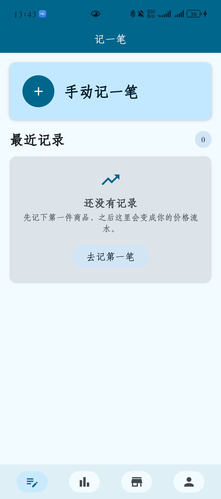
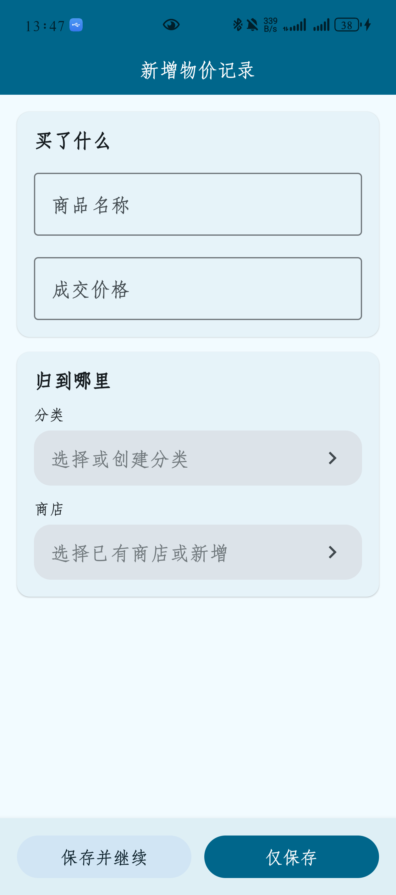
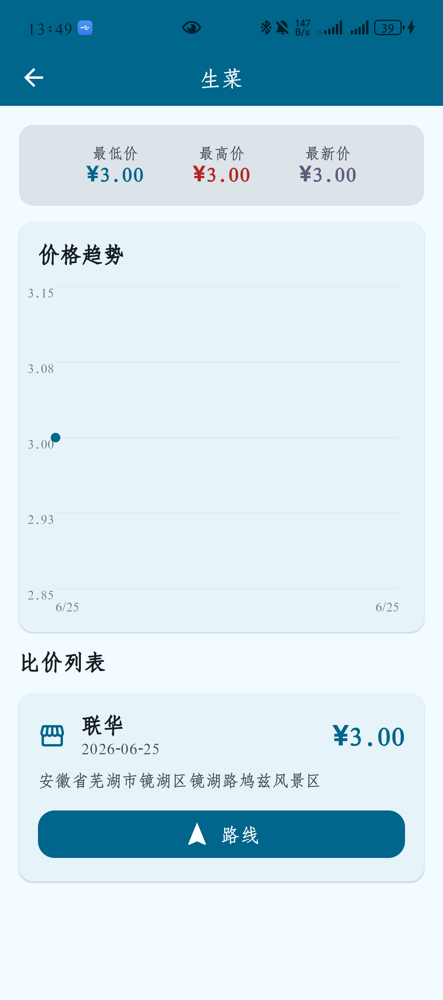
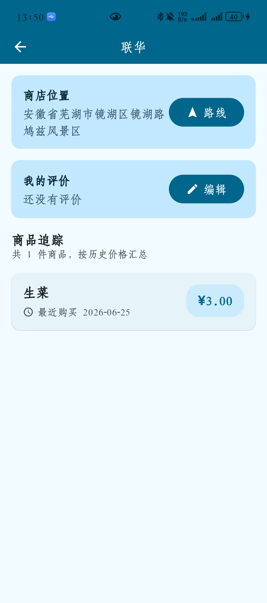
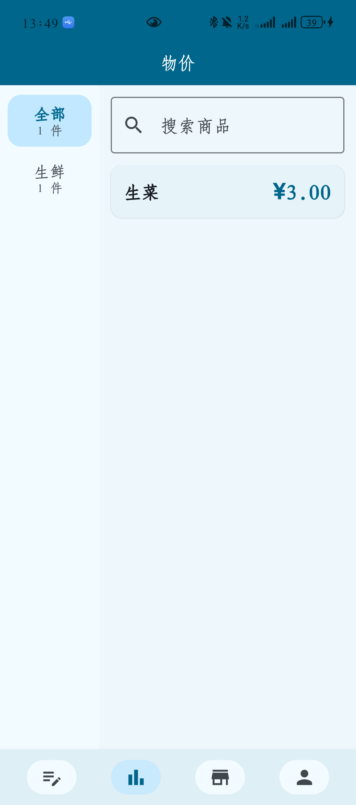
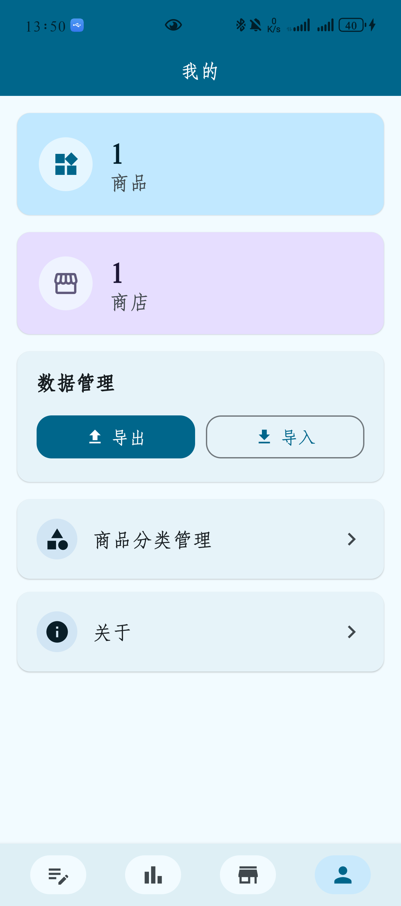

# 计价本

计价本是一款本地优先、隐私友好的个人物价记录与比价 Android 应用。它适合记录日常购物价格、追踪同一商品在不同商店的价格变化，并保存商店位置，方便下次购买前快速对比和导航。

应用数据默认保存在本机，不依赖账号体系，也不需要把个人消费记录上传到云端。

## 功能亮点

- 本地优先：商品、商店、价格记录保存在本机 Room 数据库中
- 轻量记账：专注记录“商品价格”，不做复杂财务账本
- 商店维度：支持记录商店地址、地图链接、经纬度和用户评价
- 价格对比：同一商品可查看历史价格、价格趋势和不同商店报价
- 位置导航：支持保存地图分享链接，后续可拉起地图应用规划路线
- 数据备份：支持导出和导入 `.mypd` 本地备份文件

## 功能

- 记一笔：手动录入商品名称、价格、购买时间、分类和商店
- 最近记录：在首页快速浏览近期录入的商品价格
- 商品管理：按分类查看商品，搜索商品，并进入商品详情
- 商品详情：查看价格摘要、历史记录、价格趋势和商店价格对比
- 商店管理：维护商店列表、地址信息、地图链接和个人评价
- 商店详情：查看某个商店下已记录的商品和价格范围
- 地图导航：优先使用经纬度拉起高德地图路线规划页，失败时回退到系统地图链接
- 分类管理：新增、编辑和管理商品分类
- 数据导入导出：通过 `.mypd` 文件备份和迁移本地数据
- 关于页面：查看应用信息和基础说明

## 截图

截图文件放在 [`screenshots/`](screenshots/) 目录下。你后续只需要按下面的文件名补充图片，README 会自动展示。

| 首页 | 记一笔 |
|---|---|
|  |  |

| 商品详情 | 商店详情 |
|---|---|
|  |  |

| 分类管理 | 我的 |
|---|---|
|  |  |


## 下载

APK 下载地址：

- 待发布

## 编译

环境要求：

- Android Studio Hedgehog 或更新版本
- JDK 17
- Android SDK 34
- Android 8.0/API 26 或以上设备

调试构建：

```bash
./gradlew assembleDebug
```

发布构建：

```bash
./gradlew assembleRelease
```

运行单元测试：

```bash
./gradlew testDebugUnitTest
```

## 技术栈

- Kotlin
- Jetpack Compose
- Material 3
- Navigation Compose
- Hilt
- Room
- DataStore
- Kotlin Coroutines / Flow
- kotlinx.serialization

## 项目结构

```text
app/src/main/java/com/pricekeeper/app/
├── core/       # 导航、主题、通用能力
├── data/       # Room、DAO、Repository 实现、导入导出
├── domain/     # 领域模型、Repository 接口、UseCase
└── feature/    # 首页、记一笔、商品、商店、我的等页面
```

## 数据说明

计价本当前主要维护三类核心数据：

- 商品：商品名称、分类等基础信息
- 商店：商店名称、地址、区域、地图链接、经纬度和用户评价
- 价格记录：商品、商店、价格、购买时间和备注

导出的 `.mypd` 文件用于个人备份和迁移，请妥善保管。

## 开源许可

本项目基于 [MIT License](LICENSE) 开源。
